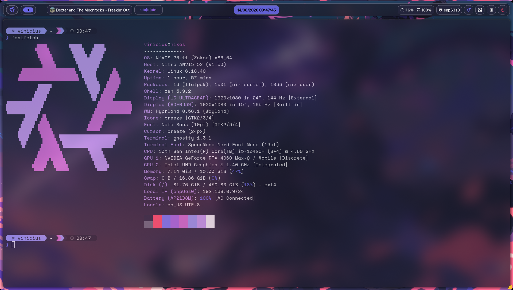
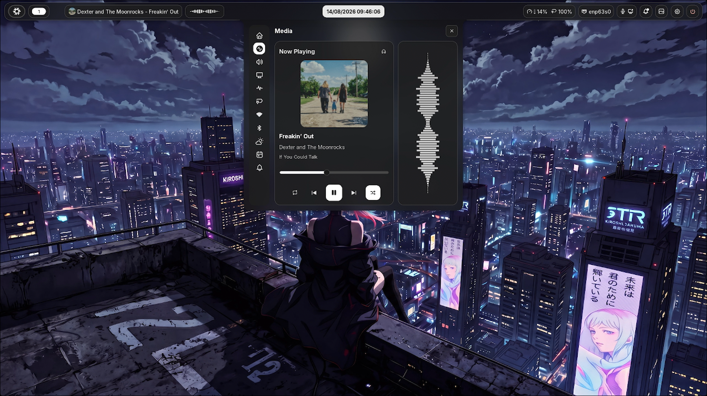
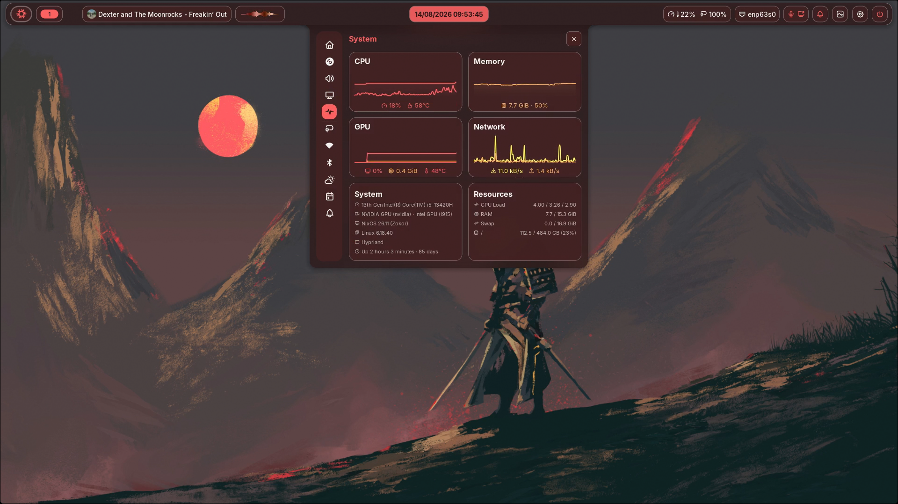
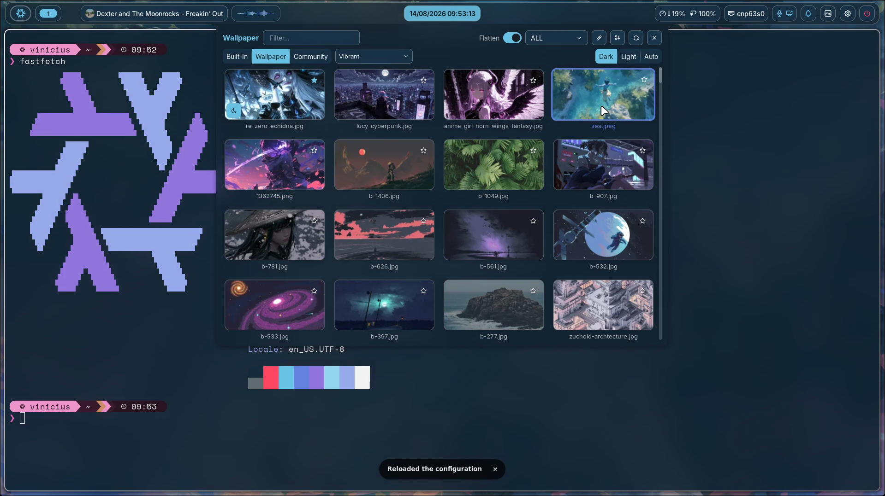

# Dotfiles

NixOS dotfiles for my Acer Nitro V 15 setup, built around Hyprland, Home Manager, and a small collection of Wayland desktop tools.

The main configuration uses Noctalia with Hyprland. An older Matugen-based stack is also kept in the repository for manual use or future reference.

## Screenshots

### Fastfetch



### Music Player



### System Monitor



### Wallpaper Selector



## Features

- **NixOS flake**: System configuration managed from `nix/flake.nix`
- **Home Manager**: User packages, programs, and config symlinks managed from `nix/home.nix`
- **Hyprland**: Wayland compositor configuration with custom binds, animations, blur, and NVIDIA-friendly settings
- **Noctalia shell**: Main desktop shell for launcher, clipboard, notifications, control center, session menu, and OSD
- **Matugen stack**: Alternative wallpaper-based theming setup for Waybar, SwayNC, Rofi, Orbit, NWG Bar, and Starship
- **Terminal workflow**: Ghostty, Zsh, Oh My Zsh, Starship, Tmux, GitHub CLI, Zoxide, Bat, Eza, Fzf, and Direnv
- **Development tools**: Neovim, Docker, Statix, Ripgrep, and Fd
- **Laptop hardware**: Acer Nitro V15 i5-13420H, NVIDIA GeForce RTX 4060

## Setup Options

### Noctalia + Hyprland

This is the current setup.

Hyprland is configured in `hyprland/hyprland.conf`, while Noctalia is managed through Home Manager and symlinked from `noctalia/`.

The Hyprland binds call Noctalia panels directly:

```bash
noctalia msg panel-toggle launcher
noctalia msg panel-toggle clipboard
noctalia msg panel-toggle notifications
noctalia msg panel-toggle control-center
noctalia msg panel-toggle session
```

Noctalia handles the main shell pieces that were previously split across multiple tools:

- Launcher
- Clipboard history
- Notifications
- Control center
- Session menu
- Volume and brightness OSD
- Window switcher

### Matugen Stack

This is the older setup created before switching to Noctalia. It is still kept in the repository in case I want to use it again.

Matugen reads templates from `matugen/templates/` and writes themed files to the matching config locations:

```bash
matugen image wallpapers/wanderer.jpg
```

The stack includes:

- `matugen/`: Theme generation and templates
- `waybar/`: Bar configuration
- `swaync/`: Notification center configuration
- `orbit/`: Quick settings panel configuration
- `rofi/`: Launcher styling
- `nwg-bar/`: Power menu configuration
- `scripts/`: Helper scripts for wallpaper reload, clipboard menu, and font updates

## Installation

Clone the repository into the expected path:

```bash
git clone git@github.com:vinialx/dotfiles.git ~/dotfiles
```

Apply the NixOS system configuration:

```bash
sudo nixos-rebuild switch --flake ~/dotfiles/nix#nixos
```

Home Manager is loaded through the NixOS flake, so user packages and config symlinks are applied as part of the rebuild.

## Configuration

### System Configuration

System-level settings live in `nix/configuration.nix`.

Main areas:

- NVIDIA graphics and PRIME sync
- Systemd-boot
- Plymouth boot theme
- NetworkManager
- PipeWire audio
- Docker
- Hyprland system support
- Zsh as default shell
- Nix flakes and garbage collection

### Home Configuration

User-level settings live in `nix/home.nix`.

Main areas:

- Noctalia module
- User packages
- Firefox, Git, Ghostty, Tmux, Starship, Zsh, Direnv, and terminal tools
- Hyprland Home Manager integration
- XDG config symlinks into this repository

### Symlinked Configs

Home Manager links selected files from this repository into `~/.config`:

```nix
"noctalia".source = lib.mkForce (
  config.lib.file.mkOutOfStoreSymlink "/home/vinicius/dotfiles/noctalia"
);

"starship.toml".source = lib.mkForce (
  config.lib.file.mkOutOfStoreSymlink "/home/vinicius/dotfiles/starship/starship.toml"
);

"ghostty/config".source = config.lib.file.mkOutOfStoreSymlink "/home/vinicius/dotfiles/ghostty/config";

 "swappy/config".source = config.lib.file.mkOutOfStoreSymlink "/home/vinicius/dotfiles/swappy/config";
```

Other configs can be used manually or added to `nix/home.nix` as needed.

## Repository Structure

```text
nix/          NixOS flake, system config, Home Manager config, custom packages
hyprland/     Hyprland compositor configuration
noctalia/     Noctalia shell configuration
matugen/      Matugen config and theme templates
waybar/       Waybar configuration
swaync/       SwayNC notification center configuration
orbit/        Orbit panel configuration
rofi/         Rofi launcher configuration
nwg-bar/      NWG Bar power menu configuration
scripts/      Desktop helper scripts
ghostty/      Ghostty terminal configuration
starship/     Starship prompt configuration
tmux/         Tmux configuration
zsh/          Custom Zsh configuration
nvim/         Neovim configuration notes
wallpapers/   Wallpaper collection
fonts/        Font lists
espanso/      Espanso snippets
```

## Useful Commands

Configure NixOS (home.nix):

```bash

nxclr (sudo nv ~/dotfiles/nix/home.nix)
```

```

```

Rebuild NixOS:

```bash
nxupd (sudo nixos-rebuild switch --flake ~/dotfiles/nix#nixos)
```

Clear garbage and old generations:

```bash
nxclrd (sudo nix-collect-garbage)
```

Update flake inputs:

```bash
nix flake update ~/dotfiles/nix
```

Format Nix files:

```bash
nix fmt ~/dotfiles/nix
```

Reload wallpaper tools from the Matugen stack:

```bash
~/dotfiles/scripts/reload-wallpaper.sh
```

Open the clipboard menu (Rofi Window) from the Matugen stack:

```bash
~/dotfiles/scripts/clipboard-menu.sh
```

## Hardware Notes

This configuration targets an Acer Nitro V 15 laptop with Intel and NVIDIA graphics.

Important settings include:

- NVIDIA proprietary driver
- PRIME sync with Intel and NVIDIA bus IDs
- `nvidia-drm.modeset=1`
- `WLR_NO_HARDWARE_CURSORS=1`
- `NIXOS_OZONE_WL=1`
- Brazilian ABNT2 keyboard layout
- `America/Sao_Paulo` timezone

Hardware-specific values may need changes before using this configuration on another machine.

## License

Personal dotfiles. Use anything useful at your own risk.

## Author

Email: vini.aloise.silva@gmail.com
